# Introdução

O mapa atual da instituição, apesar de bastante informativo, não possui interatividade, tornando a navegação confusa e pouco intuitiva. Tendo isso em vista, a criação de um aplicativo de localização indoor facilitaria a busca por locais específicos, como salas de aula, bibliotecas, áreas de convivência e laboratórios.
Nesse sentido, a dificuldade de locomoção dentro do campus universitário representa um desafio tanto para alunos quanto para funcionários, o que interfere na pontualidade em aulas e compromissos acadêmicos. Além disso, muitos estudantes, especialmente os calouros, não conhecem todas as instalações e espaços de estudo disponíveis, o que limita o aproveitamento da infraestrutura da faculdade.
Além disso, a ideia do projeto não se restringe apenas ao ambiente universitário. Posteriormente, o software pode ser expandido para outros espaços fechados e muito frequentados, como shoppings, hospitais e parques, onde a orientação indoor também se mostra um desafio.


* **Projeto:** Puc Maps
* **Repositório GitHub:** https://github.com/ICEI-PUC-Minas-CC-TI/ti1-2025-1-t2-manha-puc-maps
* **Membros da equipe:**

  * Anne Sudre (https://github.com/annesudre13)
  * Camila Menezes (https://github.com/meunomeecamila)
  * Daniel Gomes (https://github.com/dgpluks)
  * Mariana Fonseca (https://github.com/marifviana)
  * Saulo Peixoto (https://github.com/saulopf05)
  * Sérgio Manso (https://github.com/sergiomansoo)
  

A documentação do projeto é estruturada da seguinte forma:

1. Introdução
2. Contexto
3. Product Discovery
4. Product Design
5. Metodologia
6. Solução
7. Referências Bibliográficas

✅ [Documentação de Design Thinking (MIRO)](files/processo-dt.pdf)

# Contexto

O problema esta inserido no contexto atual. Isso devido ao fato de utilizarmos uma tecnologia de software como solução da dificuldade escolhida.

## Problema

A dificuldade de localização em ambientes internos prejudica a mobilidade e a experiência dos usuários, tornando a navegação dentro do campus desorganizada e, muitas vezes, confusa.

## Objetivos

O principal objetivo do aplicativo é auxiliar os alunos e funcionários a se locomoverem pelo campus de forma rápida e eficiente. Para isso, a ferramenta contará com localização em tempo real.

Além da navegação tradicional, o app poderá oferecer funcionalidades adicionais, como localização de amigos dentro do campus para facilitar encontros e estudos em grupo, consulta dos cardápios dos restaurantes universitários para otimizar a escolha das refeições, sugestões personalizadas de rotas e locais, com base no perfil e nas preferências do usuário.


## Justificativa

A dificuldade de se localizar dentro do campus é um problema recorrente enfrentado diariamente tanto pelos alunos quanto pelos professores e funcionários da universidade. A falta de um mapa interativo e de uma sinalização eficiente dificulta a mobilidade, impactando a rotina academica e administrativa. Diante desse cenário, um aplicativo de navegação indoor se torna uma solução viável e inovadora para otimizar a experiência universitária.
>

## Público-Alvo
>
O público-alvo da aplicação de localização indoor na faculdade é diversificado e abrange diferentes perfis de usuários, cada um com necessidades específicas e diferentes níveis de familiaridade com tecnologia.

Os estudantes representam a maior parcela dos usuários. Dentro desse grupo, os calouros são os que mais se beneficiarão da aplicação, pois ainda estão se adaptando ao ambiente da faculdade e podem ter dificuldades para encontrar salas de aula, laboratórios e setores administrativos. Normalmente, são jovens familiarizados com tecnologia, acostumados a aplicativos de navegação, redes sociais e ferramentas digitais, o que facilita a adoção da plataforma. Já os estudantes veteranos, embora conheçam melhor o campus, podem usar o aplicativo para otimizar seu tempo, encontrar rotas mais rápidas ou acessar locais específicos em prédios que frequentam menos.

Os professores e funcionários administrativos também são um público importante. Diferentemente dos alunos, eles podem ter uma relação variada com a tecnologia, dependendo da idade e do nível de familiaridade com dispositivos móveis. Professores que dão aulas em diferentes prédios podem utilizar a aplicação para planejar seus deslocamentos, enquanto funcionários administrativos podem usá-la para ajudar estudantes e visitantes a se localizarem.

Outro grupo relevante são os visitantes e palestrantes, que geralmente não conhecem a estrutura da faculdade e podem ter dificuldades para encontrar auditórios, salas de reunião e setores administrativos. Para eles, a aplicação pode ser uma ferramenta essencial para evitar atrasos e facilitar a experiência no campus.

Por fim, pessoas com deficiência ou mobilidade reduzida também se beneficiam do aplicativo, especialmente se ele oferecer informações sobre acessibilidade, como a localização de elevadores, rampas e banheiros adaptados. Esse público pode ter necessidades específicas que devem ser levadas em consideração no desenvolvimento da solução.
>

# Product Discovery

## Etapa de Entendimento
> * **Matriz CSD**: também conhecida por Matriz de Alinhamento, é uma ferramenta utilizada no Design Thinking para organizar informações e facilitar o processo de tomada de decisão e solução de problemas;
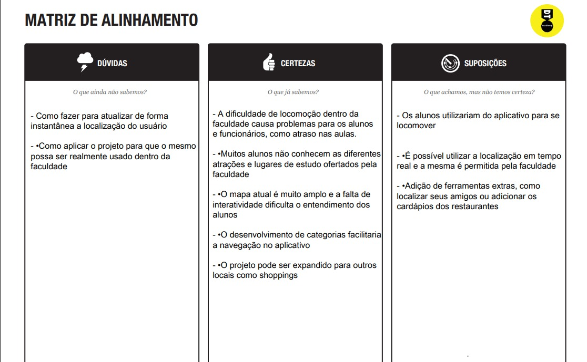

> * **Mapa de stakeholders**: ferramenta que nos permite compreender o grupo de pessoas e entidades que devemos estudar e conversar para entender mais sobre o problema
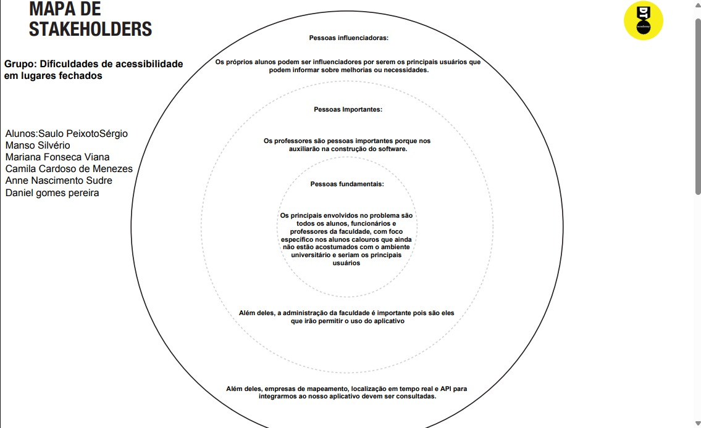
> * **Entrevistas qualitativas**: série de entrevistas qualitativas para validar suposições e solucionar as dúvidas com as principais pessoas envolvidas;
Entrevista 1 - Paula Cardoso
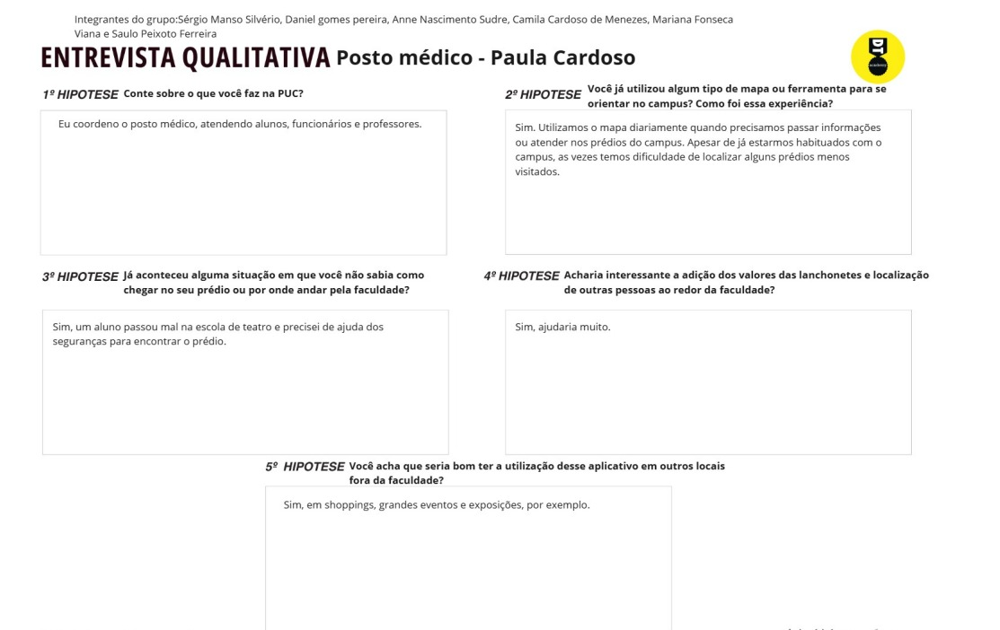
Entrevista 2 - Júlia Fonseca
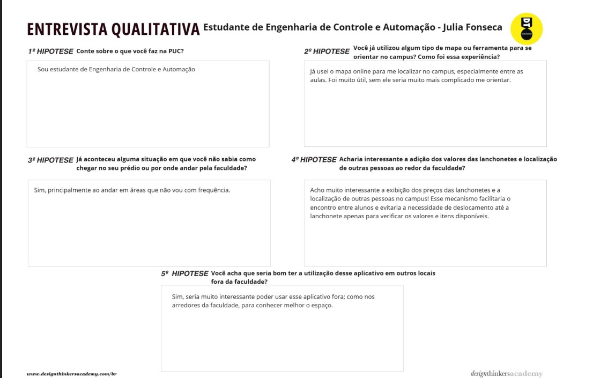
> * **Highlights de pesquisa**: um compilado do levantamento realizado por meio das entrevistas.
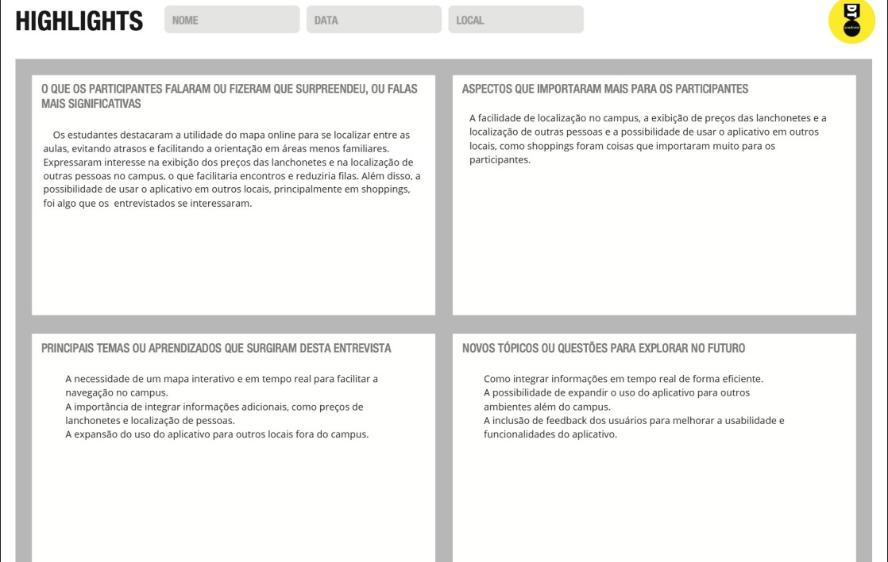

## Etapa de Definição

### Personas
Persona 1 - Clara Silva
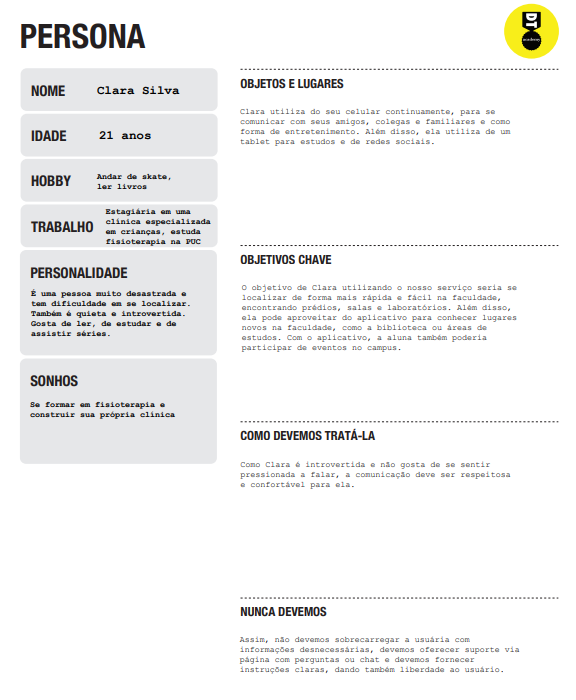

Persona 2 - Bruna Mendes
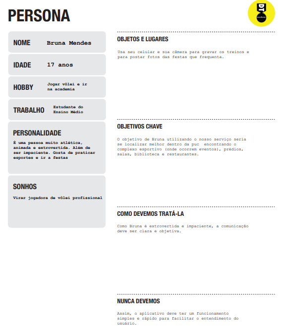

Persona 3 - Sérgio Souza
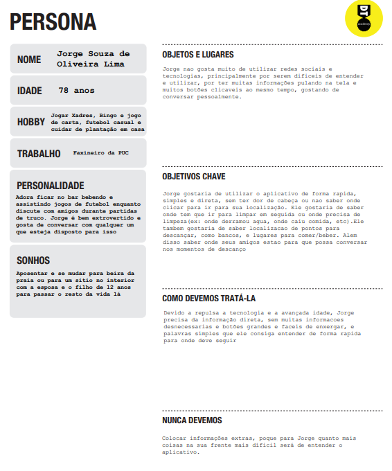

# Product Design

Nesse momento, vamos transformar os insights e validações obtidos em soluções tangíveis e utilizáveis. Essa fase envolve a definição de uma proposta de valor, detalhando a prioridade de cada ideia e a consequente criação de wireframes, mockups e protótipos de alta fidelidade, que detalham a interface e a experiência do usuário.

## Histórias de Usuários

Com base na análise das personas foram identificadas as seguintes histórias de usuários:

| EU COMO...`PERSONA` | QUERO/PRECISO ...`FUNCIONALIDADE`        | PARA ...`MOTIVO/VALOR`               |
| --------------------- | ------------------------------------------ | -------------------------------------- |
| Aluna da Universidade   | Arranjar uma forma fácil de me locomover sem ficar perdida  | Preciso chegar nas aulas no horário e descobrir o que mais a faculdade pode me oferecer           |
| Visitante da Universidade         | Encontrar com meus amigos e conhecer um pouco mais sobre a PUC     | Quero poder ter autonomia e descobrir mais sobre o lugar, além de me orientar para palestras ou campeonatos|
| Funcionário da Universidade      | Me orientar sobre as localizações de prédios e áreas da faculdade   | Facilitará e otimizará meu trabalho, pois assim eu saberei onde são os locais que devo limpar|

## Proposta de Valor

##### Proposta para Persona 1 -> Clara Silva
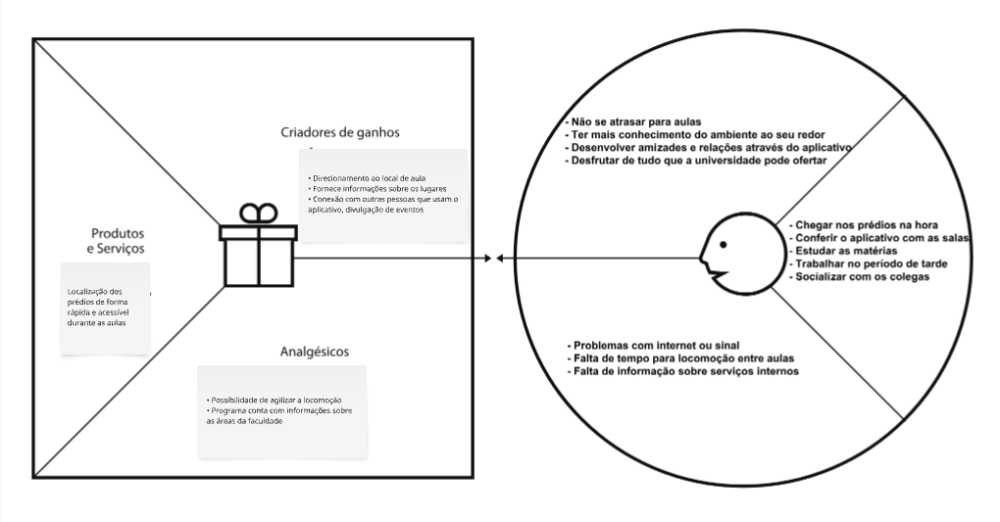

##### Proposta para Persona 2 -> Bruna Mendes
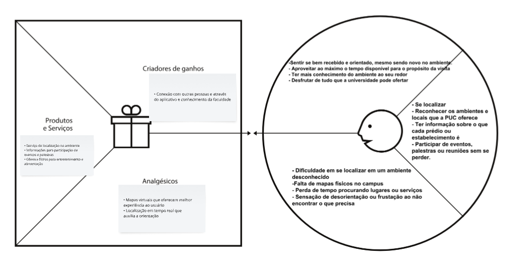


##### Proposta para Persona 3 -> Sérgio Souza
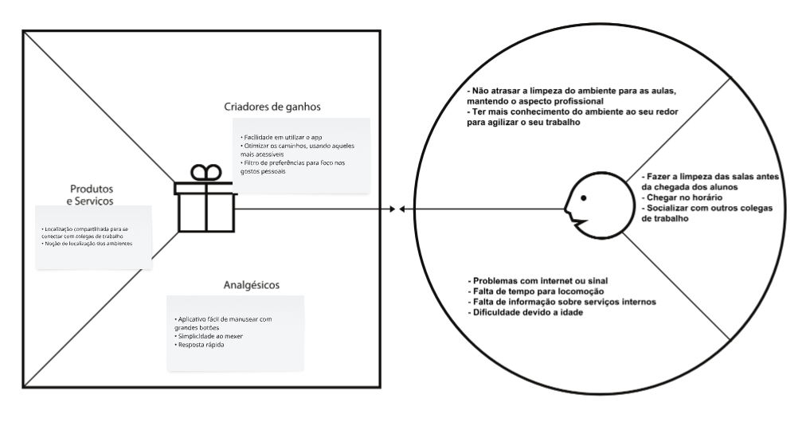


## Requisitos

As tabelas que se seguem apresentam os requisitos funcionais e não funcionais que detalham o escopo do projeto.

### Requisitos Funcionais

| ID     | Descrição do Requisito                                   | Prioridade |
| ------ | ---------------------------------------------------------- | ---------- |
| RF-001 | O software deve mostrar a localização dos prédios, lanchonetes e outros locais da universidade. | ALTA       |
| RF-002 | O software deve conter divisões de filtros para diferentes categorias como aulas, lazer, locais de estudo e alimentação. | MÉDIA     |
| RF-003 | O programa deve permitir a seleção de locais principais que fiquem marcados para que o usuário possa se localizar mais rápido | MÉDIA     |
| RF-004 | ⁠O sistema deve trazer informações sobre os prédios e atividades em cada um deles. | MÉDIA     |

### Requisitos não Funcionais

| ID      | Descrição do Requisito                                                              | Prioridade |
| ------- | ------------------------------------------------------------------------------------- | ---------- |
| RNF-001 | O site ou aplicativo deve estar disponível nos dias de semana | ALTA    |
| RNF-002 | O software deve ser de fácil acesso para alunos        | ALTA    |
| RNF-003 | O software deverá ser responsivo no celular principalmente      | ALTA    |

## Projeto de Interface

Artefatos relacionados com a interface e a interacão do usuário na proposta de solução.

### Wireframes

Estes são os protótipos de telas do sistema.
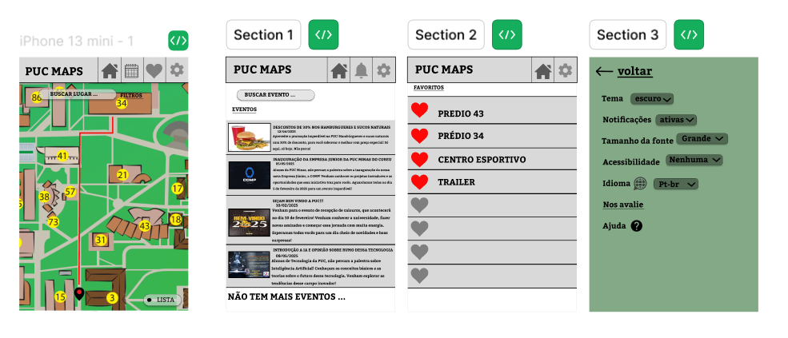

Tela 1 -> Tela de Início
Conta com o mapa para orientação, uma lista dos lugares da Universidade e quatro
ícones no canto superior direito: Home, para que seja possível retornar para a tela inicial,
Eventos para que o aluno possa descobrir mais sobre as notícias, Favoritos para
que o usuário possa favoritar seus prédios mais usados e as configurações. 
Além disso, há uma barra de pesquisa para que o cliente possa se localizar. 

Tela 2 -> Tela de notícias
Conta com mensagens, datas e ilustrações das notícias da faculdade. 

Tela 3 -> Favoritos
Nessa aba você pode favoritar os seus lugares preferidos para que fiquem 
com um acesso mais rápido

Tela 4 -> Configurações
Lá você pode personalizar seu aplicativo, mudando o tema, silenciando
notificações, mudando o idioma e ativando ferramentas de acessibilidade. 


### User Flow
Para deixar a ideia do projeto mais clara, a equipe fez o user flow em dois modelos:
fluxograma e telas, como pedido nos links de tutoriais enviados. <br>
Fluxograma:
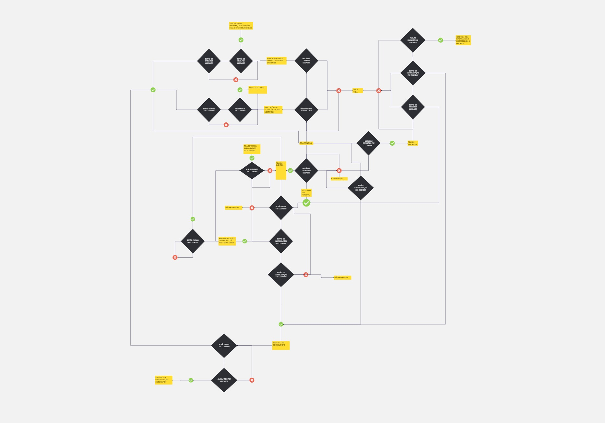
Telas:
[userflow](https://www.figma.com/design/hFSz9eHJWNaeAVlLdt1ugj/user-flow---puc-maps?node-id=0-1&t=WEsV5WqLnXucLKT2-1)
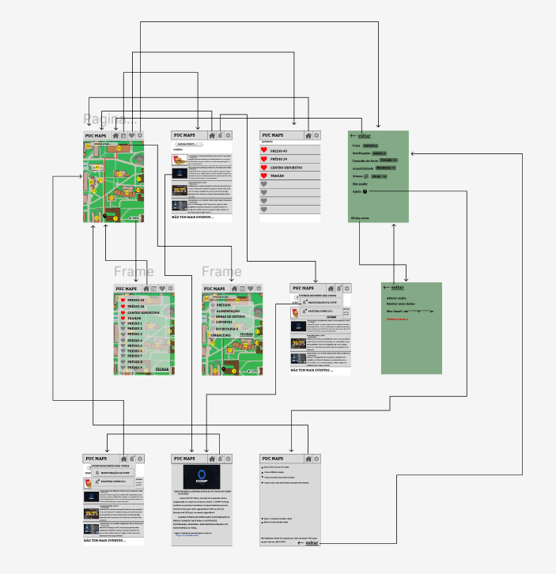


### Protótipo Interativo
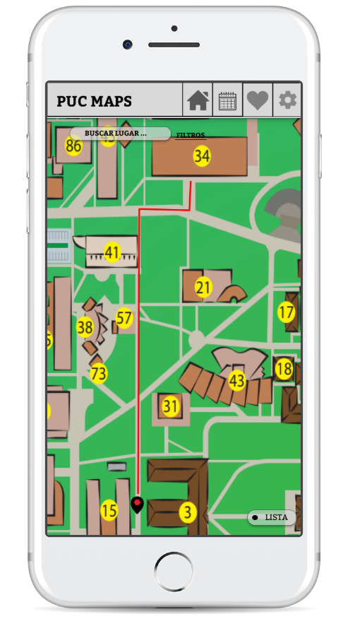
Link do protótipo:
[Protótipo](https://marvelapp.com/prototype/g06790g)
<br>
<br>
<br>


# Metodologia

Para a realização deste trabalho, foram conduzidas pesquisas com diversos grupos do público-alvo, incluindo alunos, professores e funcionários da universidade. A análise dos dados coletados por meio de entrevistas individuais foi realizada de forma colaborativa, garantindo a inclusão de múltiplas perspectivas e enriquecendo o projeto com diferentes realidades.
A equipe se organizou principalmente por meio de redes sociais, facilitando a comunicação e a realização de reuniões entre membros responsáveis por tarefas semelhantes. O laboratório da universidade serviu como principal ponto de encontro para troca de ideias e compartilhamento de pesquisas. Além disso, o uso de arquivos editáveis, como os do Google Docs, garantiu que todas as contribuições fossem acessíveis a todos os integrantes do grupo.
A divisão de papéis foi estruturada considerando as habilidades e interesses de cada membro. No entanto, reuniões coletivas foram realizadas para que todos pudessem contribuir com suas opiniões em todas as etapas do trabalho. As atividades desenvolvidas na plataforma Miro foram elaboradas de forma colaborativa durante reuniões e aulas. Já as demais tarefas foram organizadas em três áreas principais: parte criativa, produção textual e formatação e estruturação, sendo que cada uma contou com a responsabilidade de dois integrantes.


## Ferramentas

Relação de ferramentas empregadas pelo grupo durante o projeto.

| Ambiente                    | Plataforma | Link de acesso                                     |
| --------------------------- | ---------- | -------------------------------------------------- |
| Processo de Entrega de Arquivos | Miro       | https://miro.com/welcomeonboard/V3VMTm9WUU0wMityVFp1b1JMd1FadlFjVlhRbEo5MDU4SXg1R21sY2xHMWxSZUN1RWd5aCttenViUXgwMDBZVTRka2NLeDNkVEl1M252RmErbU5Vai82THk2TG81Wm05OUtBdGlEZjFjZnR2TkZpRlQ0MkRsU0JvUlZaY1ZFdXJBS2NFMDFkcUNFSnM0d3FEN050ekl3PT0hdjE=?share_link_id=611181900261      |
| Repositório de código     | GitHub     | https://github.com/ICEI-PUC-Minas-CC-TI/ti1-2025-1-t2-manha-puc-maps  |
| Protótipo Interativo       | MarvelApp  | https://marvelapp.com/prototype/g06790g |
| Figma fluxo de telas                        |  Figma       |            https://www.figma.com/design/hFSz9eHJWNaeAVlLdt1ugj/user-flow---puc-maps?node-id=0-1&t=WEsV5WqLnXucLKT2-1                                        |

## Gerenciamento do Projeto
Como falado anteriormente no tópico de Metodologia, a equipe de seis
integrantes foi divididas em duplas, sendo Camila e Daniel responsáveis pela parte
criativa, Anne e Mariana pela parte textual e Saulo e Sérgio responsáveis
pela formatação e estruturação.
Porém, nas reuniões feitas com o grupo, cada integrante pôde opinar no
quesito que achasse necessário, fazendo assim com que 
todas as tarefas fossem feitas de forma colaborativa. 
A seguir, apresentamos o quadro com a divisão das tarefas:
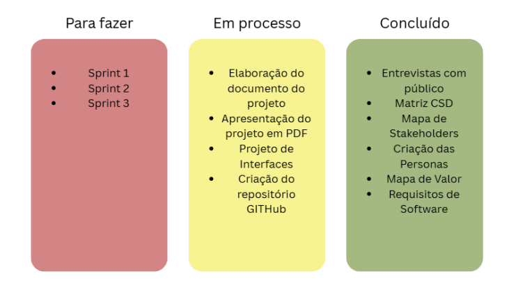
>


# Solução Implementada
A nossa solução é a criação de um software denominado Puc Maps, que ofereça
um mapa atualizado e detalhado com informações acessíveis para os alunos. 
O mapa conta com filtros para que fique mais fácil a escolha e entendimento
da universidade, garantindo assim a sua personalização.
Além disso, há uma página de notícias e eventos para que os alunos de variados cursos fiquem por dentro do que está acontecendo no ambiente universitário e a possibilidade de
favoritar prédios, atrações ou áreas do campus. 

## Vídeo do Projeto

O vídeo a seguir traz uma apresentação do problema que a equipe está tratando e a proposta de solução. ⚠️ EXEMPLO ⚠️

[](https://www.youtube.com/embed/70gGoFyGeqQ)

> ⚠️ **APAGUE ESSA PARTE ANTES DE ENTREGAR SEU TRABALHO**
>
> O video de apresentação é voltado para que o público externo possa conhecer a solução. O formato é livre, sendo importante que seja apresentado o problema e a solução numa linguagem descomplicada e direta.
>
> Inclua um link para o vídeo do projeto.

## Funcionalidades

Esta seção apresenta as funcionalidades da solução.Info

##### Funcionalidade 1 - Cadastro de Contatos ⚠️ EXEMPLO ⚠️

Permite a inclusão, leitura, alteração e exclusão de contatos para o sistema

* **Estrutura de dados:** [Contatos](#ti_ed_contatos)
* **Instruções de acesso:**
  * Abra o site e efetue o login
  * Acesse o menu principal e escolha a opção Cadastros
  * Em seguida, escolha a opção Contatos
* **Tela da funcionalidade**:


> ⚠️ **APAGUE ESSA PARTE ANTES DE ENTREGAR SEU TRABALHO**
>
> Apresente cada uma das funcionalidades que a aplicação fornece tanto para os usuários quanto aos administradores da solução.
>
> Inclua, para cada funcionalidade, itens como: (1) titulos e descrição da funcionalidade; (2) Estrutura de dados associada; (3) o detalhe sobre as instruções de acesso e uso.

## Estruturas de Dados

Descrição das estruturas de dados utilizadas na solução com exemplos no formato JSON.Info

##### Estrutura de Dados - Contatos   ⚠️ EXEMPLO ⚠️

Contatos da aplicação

```json
  {
    "id": 1,
    "nome": "Leanne Graham",
    "cidade": "Belo Horizonte",
    "categoria": "amigos",
    "email": "Sincere@april.biz",
    "telefone": "1-770-736-8031",
    "website": "hildegard.org"
  }
  
```

##### Estrutura de Dados - Usuários  ⚠️ EXEMPLO ⚠️

Registro dos usuários do sistema utilizados para login e para o perfil do sistema

```json
  {
    id: "eed55b91-45be-4f2c-81bc-7686135503f9",
    email: "admin@abc.com",
    id: "eed55b91-45be-4f2c-81bc-7686135503f9",
    login: "admin",
    nome: "Administrador do Sistema",
    senha: "123"
  }
```

> ⚠️ **APAGUE ESSA PARTE ANTES DE ENTREGAR SEU TRABALHO**
>
> Apresente as estruturas de dados utilizadas na solução tanto para dados utilizados na essência da aplicação quanto outras estruturas que foram criadas para algum tipo de configuração
>
> Nomeie a estrutura, coloque uma descrição sucinta e apresente um exemplo em formato JSON.
>
> **Orientações:**
>
> * [JSON Introduction](https://www.w3schools.com/js/js_json_intro.asp)
> * [Trabalhando com JSON - Aprendendo desenvolvimento web | MDN](https://developer.mozilla.org/pt-BR/docs/Learn/JavaScript/Objects/JSON)

## Módulos e APIs

Esta seção apresenta os módulos e APIs utilizados na solução

**Images**:

* Unsplash - [https://unsplash.com/](https://unsplash.com/) ⚠️ EXEMPLO ⚠️

**Fonts:**

* Icons Font Face - [https://fontawesome.com/](https://fontawesome.com/) ⚠️ EXEMPLO ⚠️

**Scripts:**

* jQuery - [http://www.jquery.com/](http://www.jquery.com/) ⚠️ EXEMPLO ⚠️
* Bootstrap 4 - [http://getbootstrap.com/](http://getbootstrap.com/) ⚠️ EXEMPLO ⚠️

> ⚠️ **APAGUE ESSA PARTE ANTES DE ENTREGAR SEU TRABALHO**
>
> Apresente os módulos e APIs utilizados no desenvolvimento da solução. Inclua itens como: (1) Frameworks, bibliotecas, módulos, etc. utilizados no desenvolvimento da solução; (2) APIs utilizadas para acesso a dados, serviços, etc.

# Referências

As referências utilizadas no trabalho foram:

* RAMOS, Cristhiane da Silva. Visualização cartográfica e cartografia multimídia: conceitos e tecnologias. São Paulo: Editora UNESP, 2005.

* PUC Minas. Campus Coração Eucarístico. Disponível em: https://www.pucminas.br/mundopucminas/Paginas/CampusCoracaoEucaristico.aspx#:~:text=O%20maior%20entre%20os%20dez,miss%C3%A3o%20inspirada%20no%20esp%C3%ADrito%20human%C3%ADstico. Acesso em: 1 abr. 2025.

* PUGLIESI, Edmur Azevedo. Desenvolvimento de mapa dinâmico para sistema de navegação terrestre. 2002.